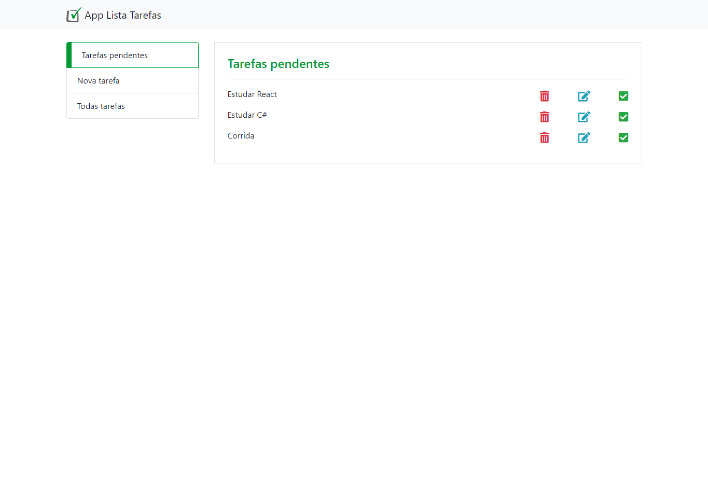

<h1 align="center"> Projeto APP Lista de Tarefas </h1>

Projeto desenvolvimento com o objetivo de colocarmos em pratica os recursos de comunicação entre o front end, servidor e back end .
 

  <a href="#-tecnologias">Tecnologias</a>&nbsp;&nbsp;&nbsp;|&nbsp;&nbsp;&nbsp;
  <a href="#-projeto">Projeto</a>&nbsp;&nbsp;&nbsp;|&nbsp;&nbsp;&nbsp;
  <a href="#-layout">Layout</a>&nbsp;&nbsp;&nbsp;|&nbsp;&nbsp;&nbsp;
  <a href="#memo-licença">Licença</a>

  

 

  

## 🚀 Tecnologias

Esse projeto foi desenvolvido com as seguintes tecnologias:

- HTML e CSS
- JavaScript
- Git e Github
- Bootstrap
- PHP
- MySQL(MariaDB)

## 💻 Projeto

O App Lista de tarefas consiste em um aplicativo para acumulas as tarefas do cotidiano e auxiliar na organização pessoal, tendo em vista possibilidades de adicionar tarefas, atualizar, remover e verificar o status (pendente/realizado).

## :memo: Licença
